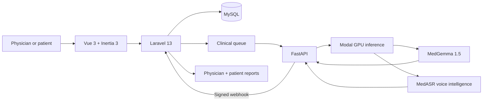

<div align="center">
  

  <h1>SihatAI</h1>
  <p><strong>One grounded clinical intelligence layer for imaging, labs, documents, history, and voice.</strong></p>
  <p>Built for physicians, patients, and Malaysia's healthcare ecosystem.</p>

  <p>
    <a href="https://sihat-ai.vxms.dev/">
      
    </a>
    <a href="docs/pitch-deck/SihatAI-Pitch-Deck.html">
      
    </a>
  </p>

  <p>
    
    
    
    
    
  </p>

  <p>
    <a href="#the-clinical-gap">The gap</a> ·
    <a href="#how-sihatai-works">How it works</a> ·
    <a href="#why-sihatai">Why SihatAI</a> ·
    <a href="#explore-the-live-demo">Demo guide</a> ·
    <a href="#architecture">Architecture</a>
  </p>
</div>

---

## The clinical gap

Medical data is multimodal, but the tools around it are fragmented.

| Clinical input        | The disconnected experience                                 | The SihatAI experience                                                |
| --------------------- | ----------------------------------------------------------- | --------------------------------------------------------------------- |
| Medical imaging       | Findings are separated from the anatomy behind them         | Visual findings with localization, confidence, and clinical context   |
| Laboratory reports    | Values remain trapped inside PDFs                           | Structured biomarkers, severity flags, and longitudinal trends        |
| Clinical knowledge    | Generic answers overlook local guidance and patient history | Evidence grounded in Malaysian MOH guidelines and prior records       |
| Patient communication | One technical report tries to serve everyone                | A clinical report for physicians and a clear explanation for patients |

> **SihatAI replaces disconnected handoffs with one inspectable, evidence-grounded source of clinical truth.**

## How SihatAI works

Every medical artifact enters a single agentic pipeline:

```text
INGEST  →  DE-IDENTIFY  →  ROUTE  →  ANALYZE  →  GROUND  →  GUARD  →  COMPOSE
```

The pipeline produces one canonical findings object, then adapts the explanation for each audience while preserving the same underlying evidence.

| 01 · Understand                                       | 02 · Reason                                                                | 03 · Protect                                                          | 04 · Communicate                                                            |
| ----------------------------------------------------- | -------------------------------------------------------------------------- | --------------------------------------------------------------------- | --------------------------------------------------------------------------- |
| Imaging, labs, clinical documents, history, and voice | Specialist routing, MedGemma analysis, hybrid RAG, and temporal comparison | De-identification, confidence calibration, guardrails, and escalation | Physician reports, patient explanations, citations, and multilingual output |

## One truth, two useful voices

| Physician workspace                           | Patient experience                          |
| --------------------------------------------- | ------------------------------------------- |
| Technical findings and differential diagnoses | Plain-language explanation of each result   |
| Confidence scores and severity labels         | Clear meaning and practical next steps      |
| Bounding-box visual localization              | Questions to discuss with the doctor        |
| Biomarker trends and prior-study comparison   | Accessible longitudinal health trends       |
| Guideline citations and agent traces          | Clinician-approved information              |
| Editable draft and clinical sign-off          | English, Bahasa Melayu, Mandarin, and Tamil |

The evidence is generated once. The presentation changes to match the person reading it.

## Why SihatAI

### 🩻 Multimodal by design

Chest X-rays, CT and MRI studies, dermatology, ophthalmology, histopathology, laboratory PDFs, clinical documents, and spoken symptoms all move through one connected workflow.

### 🇲🇾 Grounded in Malaysia

Hybrid retrieval combines dense search, BM25, and maximal marginal relevance to connect findings with Malaysian Ministry of Health Clinical Practice Guidelines, patient history, and local clinical context.

### 🛡️ Safety as a control plane

PII and PHI de-identification, confidence-aware publishing, evidence citations, guardrail vetoes, critical-value escalation, audit events, and physician sign-off operate throughout the workflow.

### 🔎 Built for accountable AI

Every analysis preserves visual localization, confidence, citations, agent hops, model metadata, and longitudinal context so clinicians can inspect the evidence behind the report.

### 🗣️ Designed for real people

SihatAI turns the same grounded findings into dense clinical reporting for physicians and calm, actionable guidance for patients across Malaysia's major languages.

## Product experience

| Workspace               | Highlights                                                                                                |
| ----------------------- | --------------------------------------------------------------------------------------------------------- |
| **Physician dashboard** | Record volume, active analyses, patient overview, critical flags, recent studies, and biomarker watchlist |
| **Medical records**     | Multimodal upload, automatic routing, analysis lifecycle, confidence, severity, and evidence              |
| **Clinical report**     | Findings, differential diagnosis, recommendations, citations, editing, and sign-off                       |
| **Patient health**      | Plain-language results, health trends, action plans, and questions for the doctor                         |
| **Voice triage**        | Spoken interview prompts, symptom capture, transcription, and structured urgency guidance                 |
| **Evaluation lab**      | Medical reasoning, report grounding, quality, and safety evaluation                                       |

The interface follows the **Clinical Field Atlas** design language: calm clinical surfaces, cobalt annotation ink, technical metadata, and a clear evidence hierarchy.

## Explore the live demo

<div align="center">
  <p><strong>No installation. No account setup. No password to type.</strong></p>
  <a href="https://sihat-ai.vxms.dev/">
    
  </a>
</div>

Open **[sihat-ai.vxms.dev](https://sihat-ai.vxms.dev/)** and choose a guided profile:

| Demo profile                     | Best for exploring                                                                            |
| -------------------------------- | --------------------------------------------------------------------------------------------- |
| **Physician · Dr. Aisha Rahman** | Multimodal analysis, clinical evidence, report review, sign-off, voice triage, and evaluation |
| **Patient · Ahmad bin Hassan**   | Plain-language reports, action plans, health trends, and voice-based symptom guidance         |

Select a profile and press **Log in**. Access is prepared automatically.

### Physician tour

1. **Start at the dashboard** to review record volume, active analyses, patients, critical flags, recent records, and the biomarker watchlist.
2. **Open Records** and select a completed study for an immediate tour, or choose **Upload record** to submit an artifact.
3. **Upload and analyze** by adding a title, assigning the patient, selecting a report language, and providing an image, PDF, DICOM file, or study archive.
4. **Follow the pipeline** as SihatAI de-identifies, routes, analyzes, grounds, checks, and composes the result.
5. **Inspect the evidence** through localized findings, confidence and severity labels, biomarkers, citations, longitudinal changes, similar cases, and agent traces.
6. **Review the clinical report**, edit the draft if needed, then select **Sign report** to approve the patient explanation.
7. **Try Voice Triage** using a guided spoken prompt, recorded symptoms, or typed symptom text.
8. **Open Evaluation** to explore the quality and safety layer behind the product.

### Patient tour

1. Log out from the profile menu and select **Patient · Ahmad bin Hassan** on the login screen.
2. **Review My Health** to see analyzed records, results needing attention, recent reports, and biomarker trends.
3. **Open a signed record** to read the clinical findings in clear, patient-friendly language.
4. **Review the action plan** and suggested questions to discuss with the doctor.
5. **Try Voice Triage** to describe symptoms by voice or text and view structured guidance.

> The two-profile journey demonstrates SihatAI's core promise: **one evidence-grounded clinical truth, delivered with the right level of detail for each person.**

## Architecture



Laravel manages identity, authorization, records, queues, and report workflows. FastAPI provides the typed AI contract and delegates GPU inference to Modal. Signed asynchronous callbacks keep the product and intelligence layers independently scalable.

<details>
<summary><strong>Technology stack</strong></summary>

| Layer           | Technology                                                                 |
| --------------- | -------------------------------------------------------------------------- |
| Web application | PHP 8.4, Laravel 13, Fortify, queues                                       |
| Frontend        | Vue 3, TypeScript, Inertia.js 3, Wayfinder, Tailwind CSS 4, shadcn-vue     |
| AI service      | Python, FastAPI, Pydantic, HTTPX, Modal                                    |
| Intelligence    | MedGemma 1.5, Malaysia-focused adaptation, MedASR, hybrid RAG              |
| Data            | MySQL, clinical artifact storage, MOH guideline index                      |
| Quality         | Pest 4, Larastan, ESLint, Prettier, TypeScript, evaluation regression gate |

</details>

<details>
<summary><strong>Repository map</strong></summary>

```text
app/                     Laravel application, jobs, policies, and clinical services
ai-service/              FastAPI, Modal inference, OCR, DICOM, and LoRA tooling
database/                Schema, factories, guidelines, and clinical demo data
docs/                    Pitch deck, project brief, and testing artifacts
resources/js/            Vue and Inertia physician and patient interfaces
resources/css/           Clinical Field Atlas tokens and global styling
routes/                   Web and authentication routes
tests/                    Pest feature and unit tests
```

</details>

## Project documents

- **[Interactive pitch deck](docs/pitch-deck/SihatAI-Pitch-Deck.html)**: product story, experience, architecture, responsible AI, and differentiation.
- **[Project summary](docs/project-summary.html)**: concise overview of the platform, pipeline, audiences, technology, and quality strategy.

---

<div align="center">
  <h3>See one clinical truth become two useful voices.</h3>
  <p>Explore SihatAI as a physician, then experience the same evidence as a patient.</p>
  <a href="https://sihat-ai.vxms.dev/">
    
  </a>
  <p><sub>SihatAI · Multimodal medical intelligence for Malaysia</sub></p>
</div>
